P1.机器学习 深度学习的概念
---

可用一句话概括：让机器具备找到一个函数。通过这个函数就可以做到很多事情。
因为函数太复杂，人类很难处理，所以需要通过机器来找到复杂的函数。这就是让机器做的事情。

alaph go 就是一个函数，输入是当前局面，然后输出下一个位置，就是做好了围棋机器。

专有名词：
regression：回归。通过一些输入训练模型，然后对于输入计算输出。比如预测房价。
classification：分类。通过输入进行分类。输出输入对应的类别。比如判断邮件是不是垃圾邮件的分类选项就是 yes/no.

==机器学习的两大重要分布就是分类和回归。==

structured learning:
结构学习指的是输入和输出都是具有结构化的对象（数列、列表、树、边界框等）。

* 举一个例子：
  预测明天youtube流量：
  1.定义函数，里面会有未知参数。
  2.定义损失函数。输入是model里面的参数。$L(b,w)$

  用来评价当前的参数b,w的值是好还是不好。
  在和几率、概率有关系的时候，一般会选择交叉熵。
  3.优化。找到w,b使得Loss最小。
  $w^* ,b^* = arg \  min\  L_{(w,b)}$

上面三个步骤合起来，叫做训练。
训练模型之后，如果想要之后未来的情况，就是说想要预测之后的情况。

超参数：在机器学习模型训练之前就要确定的参数。
梯度下降，有时候，只能找到局部最小值。
但是对于深度学习，梯度下降的真正问题并不是局部最小值。

P2.深度学习基本概念
---

`model bias`：上面的线性模型linear model。很明显会有很多的问题，比如无法处理复杂的情况。
这种，模型本身的限制，称之为`Model Bias`.
有时候就需要更加复杂的有未知参数的function。

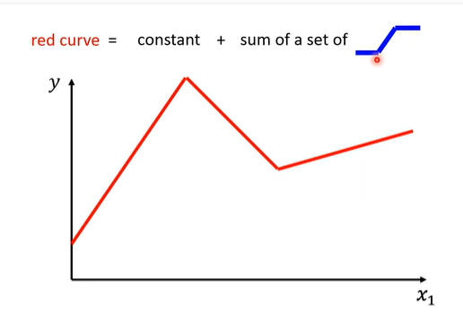

红色曲线可以看作是一个常数项加一些蓝色曲线。这个常数项就是 `红色曲线`和y轴的交点。
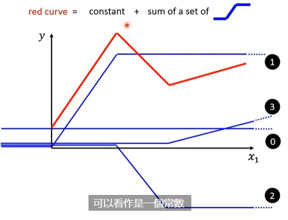

more formally:
0：常数项：通过红色曲线和y轴交点来制定。
1：关注于红色曲线的第一段，绘制蓝色曲线，到达第一个转折点之后，让自己的斜率为0.
2：在到达第一个转折点之前，斜率为0，值也为0，到达转折点之后，斜率和红色曲线斜率一样，到达下一个转折点停止。
3：在到达第2个转折点之前，斜率为0，值也为0，到达转折点之后，斜率和红色曲线斜率一样，到达下一个转折点停止。

**也就是说任何一个分段线性曲线piecewise linear curves都可以通过一个常数项和若干上面类似的蓝色曲线得到。**

* 现在问题变为，如何写出来蓝色曲线。
  用sigmod函数来逼近这个蓝色曲线：

  
  $e^x$函数的曲线：
  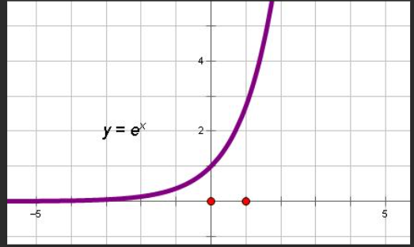

  对于蓝色曲线，x趋近于负无穷时，分母里面的1+? 中?就会很大，整个分数分母很大，接近于0.
  当x趋近于正无穷，?就会很小，整个分数就会趋近于1，趋近于平缓不动，所以就符合了蓝色曲线的特点，开始是0，中间有一些变化，最后不变。
  也叫做：$ y = c \ \  sigmod(b+wx_1)$

  可以用b c  w来得到各种各样不同的函数。然后叠加之后就可以逼近各种不同的分段线性函数。
  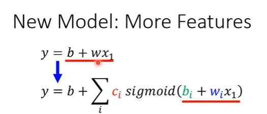
  使用更加正式的语言总结，就是上面的结果。
  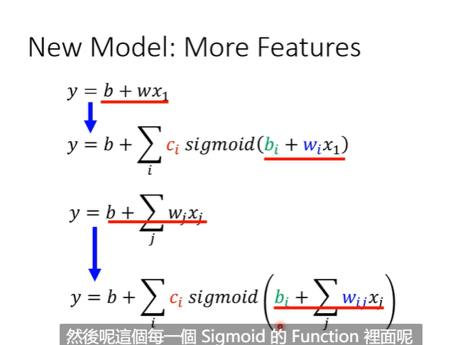

上面的求和，是为了满足最后的分段线性曲线。
下面的是因为有可能会出现很多特征的情况。比如把星期1.2.3.4.5.6.7当作不同的特征处理的时候。

w_i_j就表示 在第i个sigmod函数里面，对于第j个特征的权重。
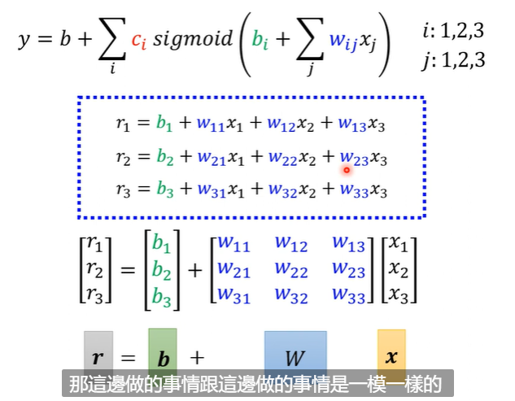

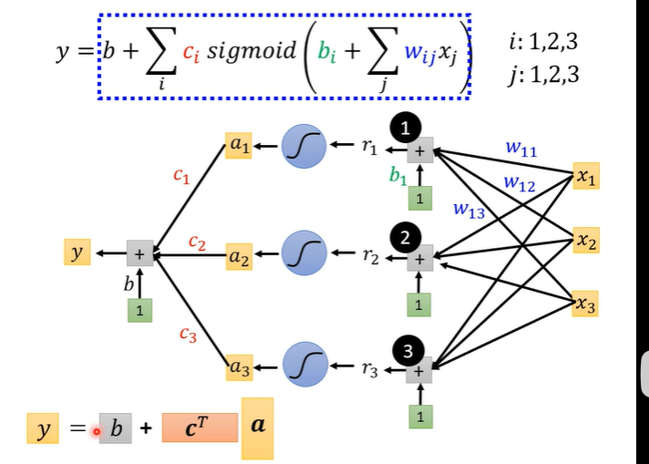

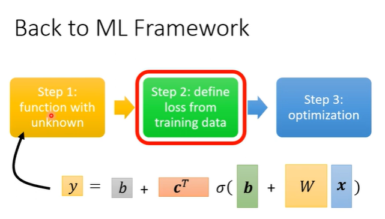

到这里，得到一个函数，也就是实现了机器学习第一步，也就是得到了一个函数里面有一些为止的参数。

同时，上面的所有的未知参数都可以用 $\theta$来表示：
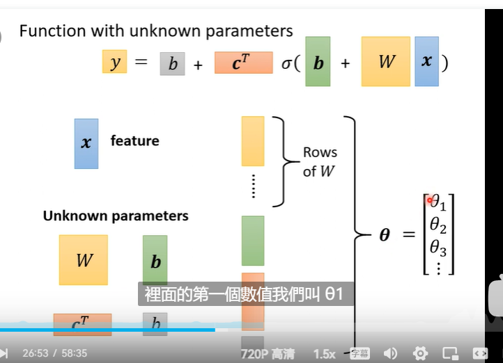

* **batch:**
  实际过程中，会采用：
  首先把所有样本、数据分为小批量，每一部分就是一个batch。
  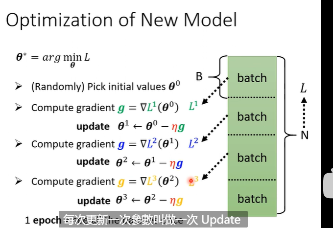
  先用第一个batch更新，再用下一个进行更新，也就是每一个batch都要进行一次update。
  然后所有的样本都进行了一次update之后，就是完成了一轮，也就是一个epoch.
  每一个epoch里面会update 的次数等于 batch的个数

* RELU:
  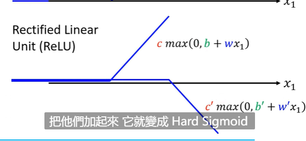
  relu本身的形式比较的简单，通过叠加两个relu就可以得到hard sigmod函数。
  所以可以把原来的一个sigmod 变为两个relu函数的和。也就是：
  

* sigmod 和 relu都是 激活函数。

  每一个神经元就是一个激活函数，很多神经元联合起来就是神经网络。
  每一排的neural就是一个layer，有很多的层次就是深度学习。

  有一个问题，deep learning正如名字里面的deep一样，有很多的层次，但是之前有提到过其实如果使用足够多的relu sigmod函数，就可以拟合所有情况，所以为什么要多层次，而不是一层全部完成？

P4.机器学习任务攻略
---

* 如何判断结果不好的时候是不是optimization的问题：
  现在有了结果，然后用一些model bias 比当前模型差，但是会很好优化的模型，然后看一下优化之后的效果会不会比现在的模型更好，如果更好的话，说明应该就是optimization有问题。
  因为更差的model bias 在优化之后，就能得到更好的结果，说明现在的模型的optimization是有问题的。

* 解决过拟合的方法：
  减少参数。1000层网络变100层次
  提前结束。
  加一些正则化 约束 限制。
  用更少的特征。
  dropout

5.考虑在优化的时候，怎么做的更好
---

> critical point 驻点，接下来的几节，都主要讲解了驻点相关知识和概念。

* 问题：如果优化失败怎么办？
  考虑如何在优化的时候，把梯度下降做的更好。 
  为什么优化会失败？
  1.gradient接近于0.也就是对于loss的微分为0.基本就没有update效果。这种情况经常出现在局部最小值的情况。 
  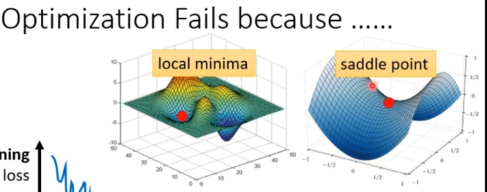
  上图第一个是局部最小值，第二个是鞍点。
  鞍点：不是局部最小值，但是导数为0.

  如果卡在local minima 没有办法 
  如果卡在saddle point ，有办法，旁边还有有路可以继续变小。
  所以怎么知道现在卡到的点是local minima 还是 saddle point?

  根据公示：
  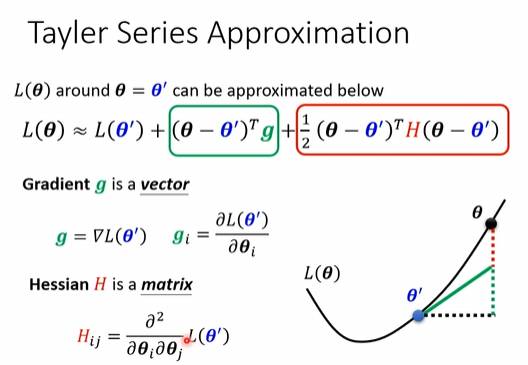

  其中 g 是损失函数对于$\theta$的一阶导。
  $H_{ij}$是对i先求导，之后将结果继续对j求导。

  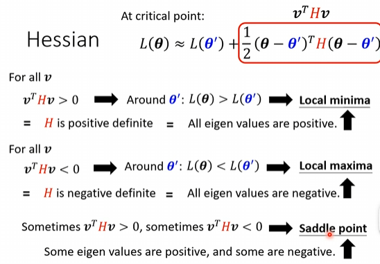
  无论是局部最小值还是鞍点，都会满足导数为0，所以中间一项为0，只看最后一项。
  使用向量v(从现在点到达另外一个点)简写上面的式子，得到$v^T H v$.
  结论：如果H的特征值都是正的，当前就是局部最大值；如果H的特征值都是负的，当前就是局部最小值；
  如果H的特征值有正有负的，当前就是鞍点；

`视频这里举了实际的例子来帮助理解`。

* local minima和saddle point哪个经常出现？
  local minima可能在目前维度下，是局部最小值，但是在更高的维度下面，其实是saddle point。
  可能在1维角度只是局部最小值，二维下是鞍点。
  saddle point会更常见。

## P6 batch:

每一次update参数的时候，只会拿一个batch进行update，而不是所有的参数一起来update.
经常在一个epoch之后，进行shuffle。对batch进行重新打乱分配。

* 整体流程如图所示：
  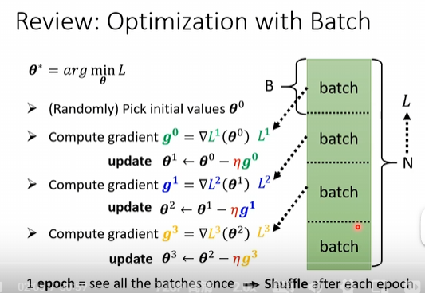
  batch size 是每一个batch里面的样本个数。

* 关于batch size 大小的讨论：

  在一定范围内，一般来说 Batch_Size 越大，其确定的下降方向越准。
  Batch_Size 增大到一定程度，其确定的下降方向已经基本不再变化（会影响随机性的引入）。

  如果batch size特别大，优化的结果会变差。
  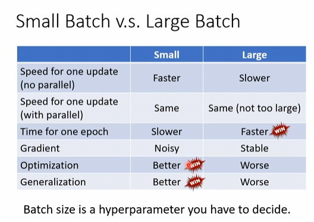

* MOMENTUM：(动量)
  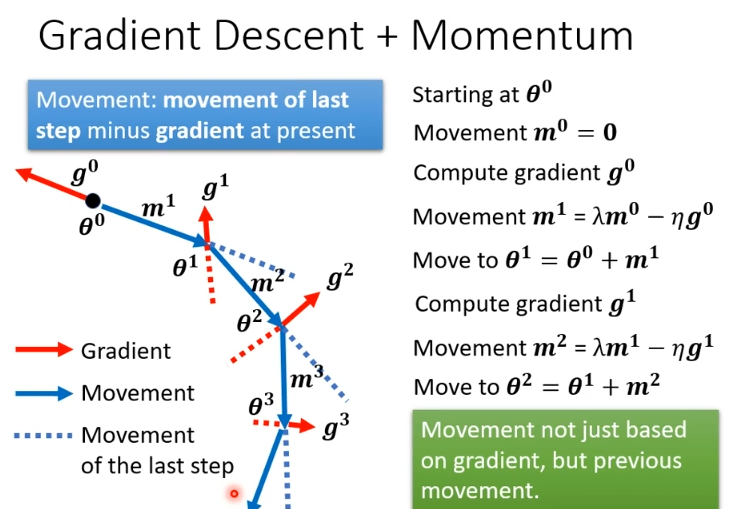

  每一次实际移动的方向，是当前的梯度方向和上一次移动的方向，两个方向合并的产物，可能合并的时候有各自的权重。
  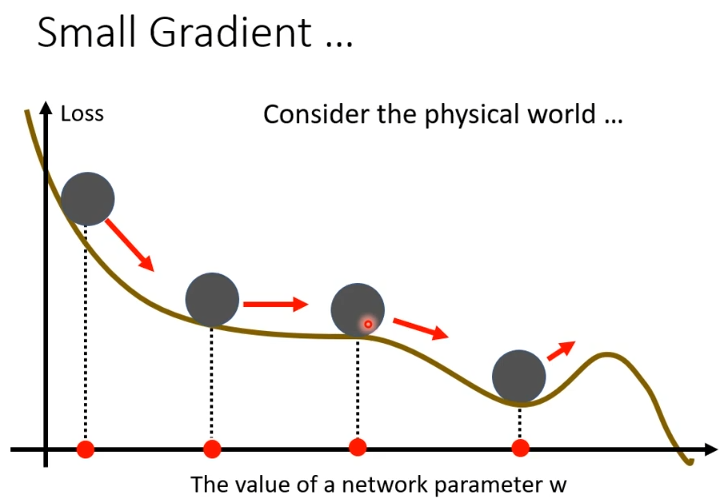

优点：在某些情况下，可以帮助我们跨越一些local minimum。

P7 学习率问题
---

如果再某一个方向上，gradient非常的小，我们希望速率能大一些。如果一个地方的微分非常的陡峭，我们就会希望速率能更小一点。**也就是不同的位置可能需要不同的学习率。**

* 为了达到上述效果，我们使用：
  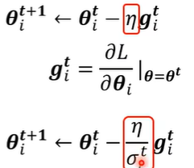
  上下标含义：下标i表明针对的是第i个参数。上标t表示现在是第t次。
  图片中第一行是原先梯度下降update的过程，g的含义是损失函数对于当前参数的偏导。
  在原先的学习率的基础上，添加了一个$\sigma_i ^t$.

  $\sigma _i ^t$的求出方式：
  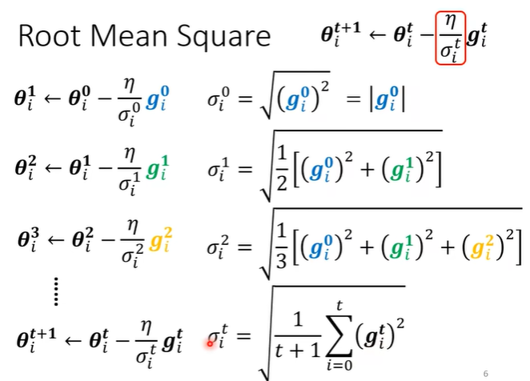

  通过添加这样一个分母，就会使得，在坡度比较大的参数更新过程中，整体学习率会变小。反之会变大。

* 另外一种情况：
  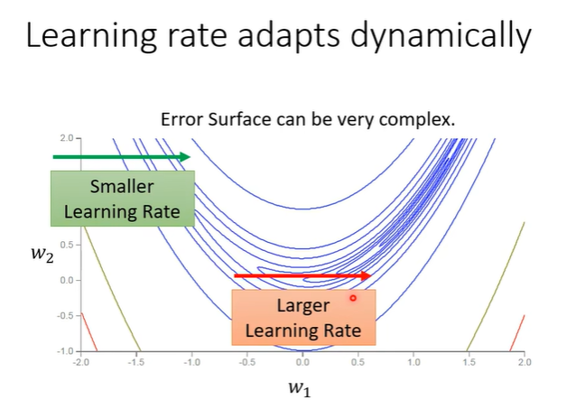
  如图所示，在前半段，因为比较陡峭，所以会希望学习率会小一点，但是后半段比较平缓，所以希望学习率会大一点。也就是我们希望得到一个可以动态变化的学习率。

  `RMSProp:`
  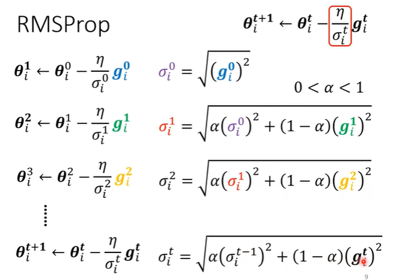

  添加$\alpha$作为之前的微分的大小对当前的影响，(1-$\alpha$)表示的是当前的微分绝对值的影响。
  当$\alpha$设置比较小，自己的微分的影响就比较大。

  ADAM:
  在学习率的选择上使用$RMSProp$，在迭代的方向上使用$MOMENTUM$.
  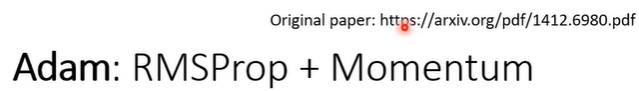

* 学习速率随时间变化：tip
  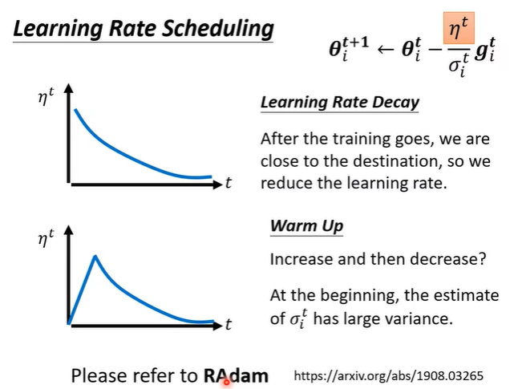
  第一种：learning rate decay:学习率逐渐降低。因为一般情况下，最开始的时候距离目标会远，后来慢慢迭代的过程中，会越来越靠近目标。
  第二种：warm up:刚开始学习率慢慢增大，后来慢慢降低。依据：对于公式：
  $$
  \theta _i ^ {t+1} \leftarrow \theta _i ^t - \frac{\eta^t}{\sigma _i ^t} g_i ^t
  $$
  对于$\sigma$最开始的时候，积累的不够，所以选择学习率小一点，随着不断累积，$\sigma$的有效性、作用会增大，然后让学习率增加到最大。使用warm up 来改变$\eta$，使用adam的算法称为RADAM。

* 总结：
  上面的所有，都是对于 optimization的各种各样的提高措施：
  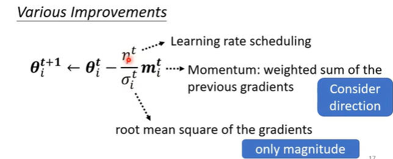
  对于$g$微分的合并，单纯的矢量叠加，考虑了之前的梯度的影响，和目前的结合，得到现在的移动方向。
  对于$\sigma$的变化：通过$\sigma$的变化，来变向影响学习速率，影响每一次移动的幅度。使得gradient小的变化幅度大，gradient大的变化幅度小。
  对于$\eta$ 的变化： [learning rate scheduling](#learning rate scheduling)

## P8: 分类怎么做

之前已经讲解过了 回归。
建立一个model，然后对于给定的变量预测一个结果。
如何进行分类？
首先可以把分类当作回归任务的一种，把结果接近1的分类为1，结果接近2的分类2，接近3的分类为3.
但是有隐含的意义就是2 和 1 的类别 会比 3和1的类别，更加相似，所以其实不是所有的分类都可以用回归来解决。
所以可以使用向量表示最后的结果：
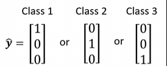
上图三个向量分别表示三种分类。

回归的过程是得到一个结果：

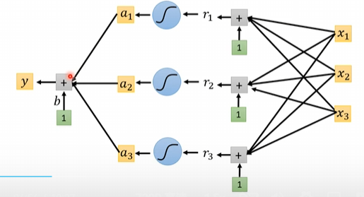
现在最后是分3类，所以要有三个结果，每一个x都有对应的y的输出。

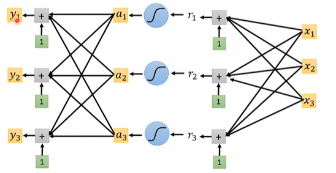

之后对于每一个x的所有结果里面，找到最接近目标的即可。
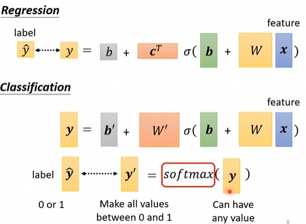

softmax的作用是归一化，具体的softmax的作用和怎么分类，这里放一个链接。

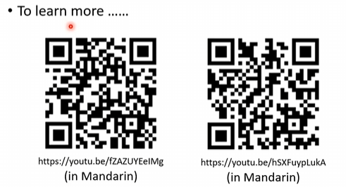

交叉熵的好处：
举例：

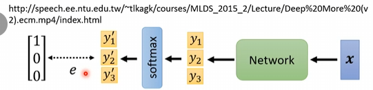
现在对x进行classfiacation。
假设现在的结果就是y3 = -1000. y2和y1都在[-10,10]之间走动。
那么error surface为：
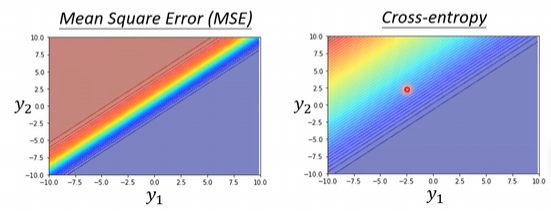
右下角是loss最小，左上角的loss最大。
会发现，在MSE的左上角，gradient基本上是0，没有太大的变化，但是交叉熵左上角的gradient也不是0，是能明显感受到损失一直的变化。所以使用交叉熵，会让梯度下降的过程，更加顺利进行。

**仅仅是不同的损失函数的定义**，都有可能影响我们能不能优化成功。

## P9：batch normalization

批归一化：在每一个batch中对于输入数据进行归一化处理。让他们的分布相同。

* 归一化的作用：
  1.在机器学习或者深度学习中，大多模型的loss计算，需要假定数据的所有特征都是零均值并且具有同一阶方差的。这样在计算loss时，才能将所有特征属性统一处理。
  比如，在KNN中，我们需要计算样本之间的欧式距离，如果样本两个属性的量纲差距过大，则大量纲的属性在距离计算中就占据了主导地位。而现实中，可能恰恰相反。所以，加入归一化，将数据的特征属性scale到统一量纲，可以一定程度解决这个问题。
  2.提升收敛速度：对于使用梯度下降优化的模型，每次迭代会找到梯度最大的方向迭代更新模型参数

* 归一化的方式：
  1.使用$ x  =\frac{x-min}{ max - min}$:可以缩放到[0,1]之间，但是对于噪声很敏感。
  2.标准化：$ x = \frac{x- \mu }{\sigma}$：
  一般，我们会记录训练集上的均值和方差，对训练集进行标准化之后，在后续测试使用模型时，对测试数据使用训练集上的方差和均值标准化测试集。

## P10: Convolutional neural network

* 机器如何读入图片？
  图片就是一个三的tensor，分别是长宽和3channels。
  首先把这些数字都取出来，进行拉直，得到一个向量就可以当作机器的输入。
  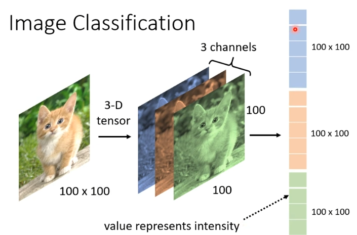

* CNN关于fully connected network的两个改进：

  * 改进1：在判读是不是某一种动物的时候，比如鸟，往往是因为一些小的pattern，比如鸟的嘴巴，鸟的爪子等等，而不是因为整体的图片。所以**不是每一个网络里面的神经元都需要整张图片的所有信息**。
    简化：
    在CNN里面，我们会设置一个respective field，感受野，每一个神经元只关注自己的感受野里面的数据，比如可以是$3\times3\times3$。 将这个$3\times3\times3$的感受野进行拉直，得到一个27维的向量，作为新的输入。而不是向之前把整个图像的所有数据都拉直得到一个向量。

    怎么决定respective field：自己决定。不同感受野之间可以重叠。
    虽然是自己设计感受野，但是讲解一下经典的设计方式：
    首先，channel是会全部看的，所以只讨论长和宽就可以，这两部分我们简称为kernel size。(卷积核大小)
    比如上面的kernel size简称为$3\times3$.
    往往一个感受野，会有很多个神经元去守备它，比如64个、128个。

    stride 是最近的感受野之间的举例，如果stride设置为1，感受野的数目多。感受野是可以重叠的，如果不可以重叠，就只有所有刚好在一个感受野里面的pattern可以被识别。
    如果最后有的越界了，就把越界的部分直接补0。也可以补整张图片的均值。
    stride，是两个方向上都有的。
    然后通过上面的方式扫完整个图片。
    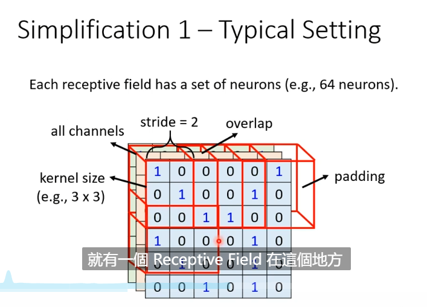

  * 第二个简化：共享参数。
    可能两个神经元的权值完全是一样的。虽然他们守备的感受野是不一样的，但是参数是一摸一样的。
    常见的在影像识别上面共享的方法是如何设定的：(假设每一个respective field都有64个neural来守备。)
    两个neural如果是共享参数，对应的不同的两个感受野，在各自拉直之后，第i个元素对应的参数都是一样的。简称为$filter_i$。一个filter里面有很多个参数，正常一个filter的尺寸刚好是和卷积核的尺寸一样。
    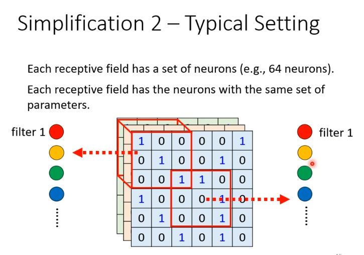

* 总结一下：
  最外层是fully connected layer。弹性最大。
  但是因为不需要看整张图片，只需要看一部分就可以判断出来一些pattern，所以引入respective field。
  因为强制了一个nerual能够看的范围变小了，所以弹性变小了。
  之后引入参数共享，本来学习的时候，两个nerual之间没有任何的联系，参数可以各自不同，加入参数共享之后，又增加了对于nerual的限制。

  上面的respective field + parameter sharing:就是 convolutional layer 卷积层。
  有卷积层的神经网络就是CNN。
  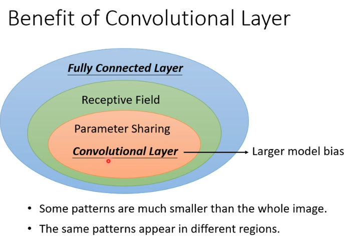

* applicatons：
  下围棋就是分类的问题，输入是现在的棋盘格局，输出下一次棋子要放的位子。
  本身完全可以看作是fully connected network 问题，但是使用CNN的效果会更好。
  为什么CNN会更好？
  首先棋盘可以看作一个图片，每一个位置有48个channel。(这个是别人设计的，有对应的意义。)
  也就是每一个位置还需要48个数字来描述状态。
  原因：1.对于棋盘，一些patterns是要比整个图片小的多的。很多关键的点，其实尺寸都不大。
  2.相同的格局，很可能在不同的位置出现。
  这两个点刚好对应上面的两个优化。
  3.但是pooling，对于棋盘，不应该使用，所以alaph go 就是没有使用pooling.这一点也警示我们，对于实际问题要实际考虑，理论上优秀的方法针对实际有可能并不适用。

对于filter，整个过程的理解，可以看一下博客：[CNN中feature map、卷积核、卷积核个数、filter、channel的概念解释，以及CNN 学习过程中卷积核更新的理解-CSDN博客](https://blog.csdn.net/xys430381_1/article/details/82529397)

