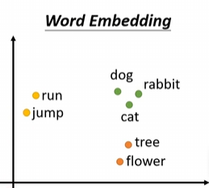
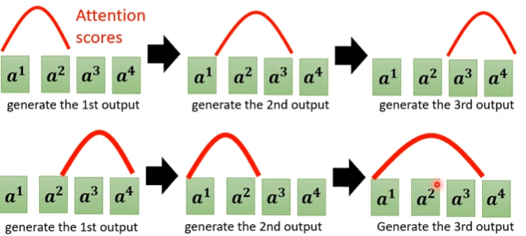

## P11：自注意力机制

问题：输入的不止一个向量并且，向量的长度不是固定的。模型如何处理？
比如文字处理里面，句子的词汇的长度就不一样，而且一个句子有很多词汇。

* 怎么把词汇表示成向量？

  * one-hot:开一个很长的向量，每一个维度对应一个词汇。
    
    缺点：dog cat 和flower的dis 两两之间都是完全一样。可以使用$word\ embedding$把单词转换为向量。

  * word-emdebbing：
    word embedding中，每一个词汇会有一个向量，而且词义相近的向量位置也会比较接近。
    (这节课并不论述如何得到word embedding)。

    在词汇转换为向量之后，一个句子就是一排向量。对应上文的**模型输入不止一个向量而是一排向量、并且一排向量中向量个数不固定。**

* what is the Output？
  1.每一个向量都对应一个label。输出的结果的个数等于输入的向量的个数。
  2.所有的向量输出一个label。比如对于句子的情感分析，输入是整个句子，输出是句子的感情。
  3.机器自己决定最后输出的label的个数。seq to seq任务。比如句子翻译，由机器自己决定翻译的目标是多少单词。

这个课程讲解第一种情况：sequence labeling：对每一个向量都 输出一个label。
如何处理？最简单的思路：把每一个向量都输入到fully connected的神经元里面，然后每一个神经元产生正确的输出就结束了。

问题：上面的例子里面，对于前面的saw和后面的saw,输出一定是一样的，因为他们对应的神经元的的输入是一样的，所以output应该也是一样的；但是这样的情况与事实不符合。
改进：考虑在判断每一个词的词性的时候，将词前后x个也一起考虑进去：

所以我们现在可以让他一个window,让他每一次都考虑整个window的输入进行输出。

但是如果说，现在我们想要的output必须需要整个sequence才可以得到需要的output怎么处理？
因为sequence的长度是可变的，如果我们仅仅使用最大的sequence的长度作为window的大小，显然会造成很大的空间浪费，不合理。所以引入**self attention.**

* 自注意力机制运作原理：
  self-attention会吃掉整个sequence的咨询，input向量的个数和output向量的个数一样，所以最后的output的向量都是考虑整个sequence之后得到的。
  

  上面黑色的框框的含义：并不是单纯的直接得到向量，而是每一个output的向量都是考虑了整个sequence之后的输出。显而易见，经过黑色框之后，就达到了之前的目标。

  同时self-attention的黑框可以叠加不止一次，self-attention处理整个sequence的咨询，fuuly-connected专注于处理某一个位置的咨询。
  

  * 具体的self-attention运作原理：
    input是一串vector。可以是正常的input，也可以是某一个隐藏层的输出(也就是前面已经进行了一些处理)。整体上来看，self-attention就是input一排a然后output一排b。每一个b都是考虑了每一个a之后产生的。
    

    * 说明，怎么产生b1:
      **1.**根据$a_1$找到sequence里面和$a_1$相关的其他向量。换种理解，找到哪些向量是我们在决定$a_1$的时候需要用到的向量，那些事和$a_1$很有关系的向量。
      每一个向量和$a_1$的关联程度用$\alpha$来表示。
      **2.**上述$\alpha$的计算过程：
      给了两个向量之后，如何得到两个向量的相关性，输出对应的关联程度$\alpha$?

      计算过程：有一个模块，输入是两个向量，输出是对应的$\alpha$.关联程度。

      Dot-Product：点积
      输入的两个向量是上图两个绿色框，各自乘以一个矩阵$W^q 、W^k$得到两个新的向量$q、k$.
      两个向量做点积dot - product就可以得到关联程度$\alpha$。

      Additive：

      视频之后主要用的都是点积的形式。
      **3.**有了上面$\alpha$的计算过程，如何套用在self-attention里面？
      对于向量$a_1,a_2,a_3,a_4$需要分别计算两两之间的关联程度。
      具体过程：

      * 1>每一个向量都做一下两步：
        first：$W^qa^i = q^i$得到$q^i$
        second：$W^ka^i = k^i$得到$k^i$
      * 2>计算$\alpha_{i,j} = q^i \cdot k^j $.
        **自己和自己的关联程度也是需要计算的。**

      **4.**计算完毕两两之间关联性之后，最后做一个$softmax$。将关联程度做一个$softmax$。不一定必须是$softmax$，也可以是$relu$。(softmax的公式和过程见上图) 
      此处的softmax相当于一种normalization.

      **5.**得到$\alpha ’$之后，根据这个新的相关性来计算最终的向量$b_i$.(以b1举例)。
      first：每一个输入向量$a_i$乘以矩阵$W^v$得到$v^i$向量。$W^v a^i = v^i$.
      second：用$v$向量乘以对应的相关性系数再相加。
      $b_1 = \sum _i \alpha’_{1,i} v^i $。效果：相关性越大的$a_i$对应的向量$v_i$在最后的$b_1$中占的比重也会很大。
      

## P12 自注意力机制(下)

> 从矩阵乘法的角度再次讲解self-attention是如何运作的。
> 讲解了multi-head、positional encoding、语音、图像、CNN、RNN、graph的简单应用。

$b_2$的计算过程：

* 使用矩阵将之前描述的过程重新描述一遍：

  * $W^qa^i = q^i$得到$q^i$。
    
    I是input的意思，I矩阵就是$a$向量按照顺序排列之后形成的矩阵。

  * $W^ka^i = k^i$得到$k^i$.
    这个过程和上面一样，用I矩阵和$W^k$相乘就可以得到K矩阵。
    

  * $W^v a^i  = v^i$：
    

  * 相关程度计算：
    先计算$a_1$和其他的关联程度：
    
    上图最右侧可以看到$a_i$和其他向量的关联程度计算可以简化为$k$组成的向量的转置与$q^i$相乘。
    将上述过程延伸到所有的input：
    
    $ A = K^T Q$.
    对$A$矩阵经过softmax，每一列进行对应的$softmax$最后就得到归一化之后的关联程度$A'$。

  * 计算输出：

    
    $O = V A'$ 

  经过上面的操作，就把整个self-attention的过程用矩阵运算的形式表达出来了。
  
  只有$W^q W^kW^v$是位置的，需要通过训练数据找到。

* Multi-head Self-attention：(Self-attention的进阶版本)
  

  为什么需要多个head？在上面通过q,k来找相关性，但是相关性可能仅仅用一个来寻找的效果不好。也许因该用不同的q、不同的k来找到不同种类的相关性。
  具体操作：以2head为例。
  1>.每一个$a_i$的$a^i、k^i、v^i$都各自经过对应的处理，得到两个和两种相关性有关系的参数。
  比如$q^i \rightarrow q^{i,1} , a^{i,2}$。
  2>.之后的$\alpha$计算过程和前面一样，在每一个种类一样的参数里面计算对应种类的相关性下面的**关联程度**。得到$b^{i,1},b^{i,2}$。
  3>.将多个head的结果经过计算得到最终的输出：

* Positional Encoding：
  经过上文的处理，可以发现对于不同的位置的参数比如$a_1,a_4$，最后的结果跟自己的position没有任何的关系。所做的操作都是只和数据本身有关系。

  缺点：对于位置也能过带来信息的例子里面，表现不好。比如在词汇判定中，一般情况下很少会出现句子的开头是动词的情况。
  改进-把位置的信息也塞进去进行训练：通过在每一个位置上面添加向量，让模型在处理每一个位置的时候，能够知道因为位置带来的一些信息。
  为每一个位置设置一个$positional \ vector\  e_i$。

  这样的$positional \ vector$是$hand-crafted$的，人为设定的，可能会有问题。
  也可以通过资料学习出来$e_i$。(是目前正在研究的一个问题)。
  相关论文：

* Self-attention for speech：
  对于语音领域，有一个很重要的问题，语音中往往$10ms$的信息会放到一个向量里面进行存储，所以向量的个数往往会比较大。输入的数目会很多。
  而我们在self attention计算的时候，复杂度是个数的平方。
  所以语音领域会选择：`Truncated Self-attention`。
  也就是在self attention的时候，不会看整个sequence，而是自己设定一个范围，只看当前范围内的其他输入向量。

* Self-attention For Images：
  自注意力机制在图像领域的使用：

  如何把一个图像看作若干向量：可以把为每一个位置看作一个向量，向量的维度就是channel的数目。
  
  上图中，每一个位置就是一个向量，每一个向量的长度是3。向量的个数一共有$5\times 10$个。

  * 比较上述在图像领域的自注意力机制和CNN：
    self - attention：
    会考虑整个图片。
    会计算每一个向量和其他所有向量的关联程度之后，再得到输出。

    CNN：
    每一个nerual只会守备自己的respective field里面的内容。
    可以认为CNN就是简化版的self-attention。self-attention是复杂版本的CNN。

    self-attention可以看作是更加flexible的CNN，CNN是收到限制的self-attention。
    
    self-attention加上一些限制就可以得到CNN。
    相关论文：

    之前说过：
    更加flexible的模型，需要更多的数据，不然可能会过拟合。
    比较有限制的模型，在data数目小的时候，也不过拟合，训练结果也比较好。
    
    上面的论文实验结果也印证了这一点，在data数据比较小的时候，CNN表现比较好;当data的数目非常多之后，self-attention的结果就会比CNN结果好。

* 比较self-attention和RNN：

  * RNN简介：RNN通向处理输入是一排向量的情况。
    
    对于每一个向量，上一次的结果和当前向量一起输入进行处理得到输出。当前输出一方面进行fully connected，另一方面也作为下一次处理的输入，下一次处理的时候也会有新的向量的输入信息。

  * RNN和Self-attention对比：
    1.RNN是不能并行处理的。
    2.RNN中，如果最后一个向量想要有第一个向量的信息，第一个向量的信息必须经过中间很多次处理之后继续保留下来。但是这个问题在self-attention中是不存在的，因为每一个self-attention都会计算所有其他向量和当前向量的相关程度，之后影响对应的效果。

    目前很多RNN的应用和架构，已经转换为了self-attention.

* Self-attention for GRAPH:
  对于图的自注意力机制：
  每一个node，可以用向量来表示。
  因为通过图，我们可以得到每两个点之间有没有边进行连接。只有两个点有边的时候，再计算这两个点之间的相关程度，如果没有相连，就直接记录$\alpha$为0就可以了。

  上面的再graph上面使用Self-attention的描述，其实就是一种GNN。(Graph Neural Network).

## P13 Transformer (上)

* transformer就是一个seq to seq的model(seq2seq)
  由机器自己决定输出的向量的长度。
  比如：语音辨识：输入是声音讯号，输出是语音对应的文字，文字的长度是可变的。需要机器自己决定需要输出几个文字。机器翻译也是seq2seq。比如把中文文字给机器，让他输出台语音频。或者反过来。都是seq2seq问题。
  训练一个聊天机器人，就是seq2seq。
  QA问题，询问问题，得到对应的answer，可以用seq2seq模型来解决。
  输入就是问题和文章：question,context。输出就是answer。就是问题的答案。
  值得注意的是，在特定的领域，并不是seq2seq的模式结果是最好的，有的往往会选择其他的模式进行处理。

  其他应用——文法剖析：产生文法树来分析句子。
  
  目标：从输入的sequence得到输出，输出是一个树形结构。
  但是这个树形结构可以转换为最上面的sequence，然后就可以硬用seq2seq model来做这件事情。

> 其他应用：

* seq2seq for multi-label Classfication：
  multi-class classfication：意思是说，不止一个class，从数个class里面，选择一个出来。
  multi-label：是指同一个东西，可能不止一个class，可能在多个类别里面。
  multi-label怎么处理，有一种想法是，就当作Multi-class classfication问题，然后找输出概率最大的前三个。
  但是可能行不通，因为有的 文件的类别可能有1个，可能有2个，3个。但是我们强硬的固定一定有三个类别，就很有可能产生问题。
  可以用seq2seq模型硬做，让机器自己决定每一个文章有多少类别。

* 物体检测：
  也可以用seq2seq模型硬做，论文：
  

上面只是在强调，seq2seq模型是一个powerful的模型。

* seq2seq模型：
  一部分是encoder：用来输入sequence,负责处理句子，然后再把处理好的结果丢给decoder，由decoder来决定要输出什么样子的sequence. 
  

* encoder部分：
  给一排向量，输出另外一排向量。输入输出的长度是一样的，这里用到的就是self-attention。
  

  

  现在encoder里面有很多block：每一个block会输入一排向量，然后输出一排向量，但是每一个block并不是神经网络的一层。因为一个block里面可能做了好几个layer做的事情。

  每一个block做的事情：
  对input的一排vector做一次self-attention，得到一排output_vector。然后output_vector每一个都会丢到fully connected神经元里面，再output另外一排vector。
  每一个vector经过一个神经元之后，做了很多我们并不清楚的事情之后，输出一个新的output_connect。

  
  可以用一个图片描述一个block做的事情：
  

  * 实际上，在transformer里面，做的事情是更多的：
    首先，经过self-attention之后，会输出一排output-vector，**还要直接加上原先的输入**，得到新的output。（这样的架构叫做残差神经网络）
    
    得到residual之后 会做归一化，这个归一化不叫batch normalization 而是 layer normalization。
    layer normalization做的事情：
    输入一个向量，输出一个向量。计算输入向量的平均值和标准差。之前的标准化 是不同样本不同特征的同一纬度，也就是不同特征(向量)的同一纬度。但是layer normalization是对不同的维度来计算mean和标准差。之后进行标准化输出一个结果，这个结果才是fully connected 的输入。
    而fc在输出的时候，也有residual的架构：(下图的右下角中有图示)会在计算的输出结果的基础上再加上这个FC的输入才会作为正确的输出。这个正确的输出，再做一次layer normalization就可以了：

* 总结一下：
  
  首先有self-attention，self-attention加上了位置的信息，也就是positional encoding。self-attention的输出会加上自己的输入，然后再做layer normalization。之后会经过全连接层，结果再做一次add & nor(加上自己的输入，然后做一次layer normalization)才得到最终的结果。

P14 Transformer: 下
---

回顾一下encoder的作用：输入一排向量经过一系列的操作之后输出一排向量。把这个output给decoder。

decoder主要包括：`autogressive`（比如语音辨识）和`Not Autogressive`。
语音辨识：输入一些音乐的向量，输出文字的向量。

* decoder做的事情：
  首先把encoder的输出读入进来，这个之后再讲。
  decoder怎么产生文字？首先给他一个特殊的符号，表示开始BOS(begin of sentence)。是一个special token。
  decoder吃到这个BOS之后会吐出一个向量，（BOS和吐出来的都是ont-hot vector），向量的长度等于要输出的vocabulary的数组。*比如decoder要输出3k个常用的中文字，那么就是one-hot vector的长度是3k。*在每一个向量里面每一个字都会对应一个值表示结果为当前文字的概率，每一次取概率最高的当作输出。
  把第一个输出继续给decoder，decoder看到最开始的begin和第一个输出产生第二个输出。
  之后：第i次输出的时候，decoder会看到第一个begin和第2,3,4,...,i-1次输出的结果，在这些的基础上产生第i个输出。通俗的讲：decoder会把前一个输出当作现在的输入。 

  所以有一个缺点：一旦前面有一个产生问题之后，后面会一直产生问题。
  

* Masked multi_head attention：
  右侧是整个decoder的流程图，**Masked multi-head attention**加一个masked的原因：
  在self-attention里面：每一个输出向量都是看到了所有的输入向量。
  
  but now：输出是一个个产生的。在输出第i个向量的时候，输入向量是前面的输出向量和begin，不能看到后面的输入向量。
  

  more formally:产生b2的时候，只考虑$a_1,a_2$。
  

* Decoder如何做到可以自己决定何时结束输出？
  和BEGIN类似，准备一个特殊的符号，END(断)就表示结束输出。
  输入了BEGIN、机器学习之后就会期望模型可以输出END。
  
  以上就是整个 auto gressive的运作方式。

* NAT：Not Autogressive:
  
  **一次把整个句子都产生出来，直接把一整排的begin的token喂给NAT Decoder，让NAT Decoder直接产生一排输出。**效果就是一次就会产生完整的句子。
  问题：怎么知道要给多少个BEGIN，产生多少个输出呢。
  1.用另外一个分类器，预测当前语音转换为文字的长度，比如得到预测为4，就在NAT里面输入4个。
  2.输出一个非常长的sequence，然后自己找END，找到END，就认为结束了，去找后面的。

  **优点**：可并行化，每一个输出可以同时进行。用GPU会更加快。
  如果用了上面第一种方式，意味着每一次我们需要输入一个参数是输出向量的个数。如果我们想让翻译工作做的快一点，就直接让这个`表示个数的参数`小一点就好了。
  NAT有`multi-modality`的问题。

* Encoder如何和Decoder之间进行连接：

  

  **Cross Attention：**
  

  Decoder接受输入产生输出，输出向量乘以$W^q$得到$q$向量。Encoder的输出向量每一个都乘以$W^K 、W^v$得到$k,v$；两个向量。先通过$q,k$之间计算相关程度，同时进行归一化，之后再和$v$相乘计算最终的输出，这个输出在当作`全连接层`的输入，进行之后的处理。
  上面的过程就是**Cross attention**的过程。
  
  上图是第二个输出的产生过程，其实和第一个是完全一致的。

* Training：
  上面的内容都是训练完毕之后如何运作，现在讨论如何训练。

  第一步：我们希望输出的结果是“机”：
  实际上输出的one-hot vector为：
  计算两者之间的`交叉熵`。让交叉熵最小化。

  拿每一次的`实际输出`和`希望得到的one-hot vector`计算交叉熵，训练的时候交叉熵的总和越小越好。

  * Teaching Forcing：using the ground truth as input。
    在训练的时候，我们并不是真的拿上一步的输出作为下一步输入，(当然这个输入不仅仅只有一个)。而是拿我们希望得到的答案作为输入。也就是不管第一步有没有输出机这个文字，训练第二个文字的时候，在输入上，我们认为第一步产生了机这个问题。
    
    这件事情，称为**Teaching Forcing**。

接下来讲述一些训练的小tips。

* Copy Mechanism：
  我们训练出来的机器，应该有复制的能力。有时候不需要一定自己创造新的词语，只需要从原先的文章里面直接`复制`就好了。特别是在总结很长文章的摘要的时候。
  在一些类似包括用户的名字，总结摘要的实际场景中，表现会比较好。
  
  上面的例子里面，很明显，机器会进行复制操作的效果会比不能进行赋值操作的效果更好。

* Guided Attention：
  有时候，机器会产生莫名奇妙的现象，比如在文字转语音过程中，"发财发财"是没有问题的，但是"发财"会漏掉第一个字。
  我们可以强迫机器在输出的时候，一定是把所有的输入都看到。这就是`Guided attention`。
  换句话说，要求机器有固定的方式进行生成。
  比如在语音合成中，一定要求方式为下图中上部分的方式，不能是下面图片下半部分的方式。
  

  这在语音辨识、语音合成中，应用广泛，因为在语音中不应该出现有的文字被模型忽略。

* Scheduled Sampling：
  在训练的时候，可能会出现一步错但是我们依然把下一个的输入强制修改为正确的向量的情况。会形成$mismatch$。这样训练出来的模型在实际的测试中，可能会出现问题。如何解决这个问题？
  可以选择在训练的时候，decoder的输入中，加一些错误的东西，不要总是给他绝对正确的输入。给他一些错误，模型可能学的更好。这一招叫做scheduled sampling。